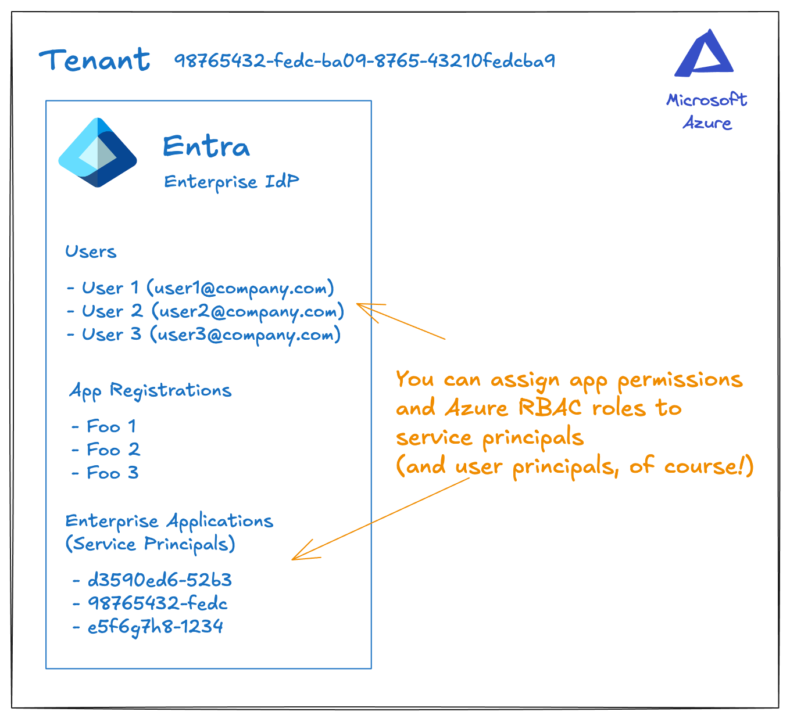
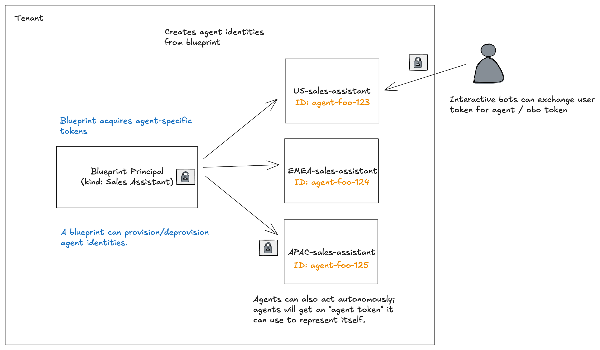
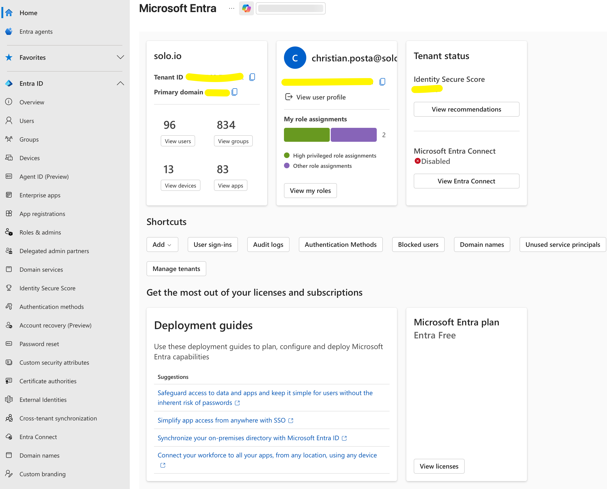
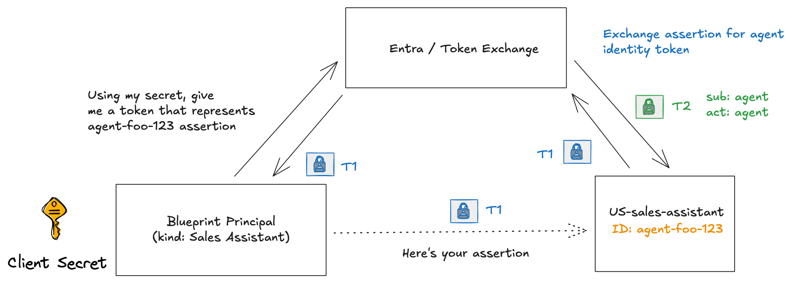

# Microsoft Entra Agent ID on Kubernetes

[Microsoft Entra Agent ID](https://learn.microsoft.com/en-us/entra/agent-id/identity-platform/) is a new feature for [Microsoft Entra](https://learn.microsoft.com/en-us/entra) that adds support for "AI Agent" workloads. In this context, an AI agent is a stateful service that can respond to tasks and work toward specified goals by using an AI model (often an LLM). An AI agent may be spun up dynamically and destroyed after its task has completed. It may last for a few seconds or many hours/days. Enterprise policy and compliance requires we know when agents make decisions and take actions. Since AI agents rely on AI models, they are non-deterministic and may take actions they originate or decide. For this reason, we need to be able to identify which workloads are AI agents, and understand what actions they take, why do they take them, and where an Agent got authorization to take the actions it did. I've written in the past about the need for [strong agent identity](https://blog.christianposta.com/do-we-even-need-agent-identity/) and the ability for agents to act as the user (impersonation) [or on behalf of the user (delegation)](https://blog.christianposta.com/agent-identity-impersonation-or-delegation/). 

This is part of a multi-part series where we dig into how Microsoft Entra Agent ID gives an option for agent identity. This set of guides will specifically dive deeply into how it works (it's full token-exchange mechanism) with the goal of getting it working on Kubernetes for Agent and MCP workloads outside of Azure. Azure has managed identities but they work within the Azure ecosystem, but if we want to expand past that, we need to understand how Agent ID works. If you're interested in this, please follow me [/in/ceposta](https://www.linkedin.com/in/ceposta) for updates!

# Part One: Understanding Entra Agent ID

Entra Agent ID builds on existing Entra capabilities around User and Service Account identity and policy and extends to natively support AI agents. To understand Entra Agent ID better, we need a little understanding about how Entra works today. 

## Microsoft Entra Identities

Microsoft Entra is a very powerful [identity platform](https://learn.microsoft.com/en-us/entra/identity-platform/v2-overview). It's often used as an enterprise identity provider for managing user identity and application identity. In Entra, the unit of identity is a *security principal* to which roles and permissions can be assigned. This can be Azure RBAC/roles or app-specific roles/scopes. There are a few types of principals that are useful for this overview:

* **user principal** - represents a human user (e.g., enterprise employee, external customer etc)
* **service principal** - non human workload (e.g., service account, containers, VMs, etc)
* **managed principal** - a type of service principal where Azure manages the credentials and lifecycle (e.g., app just says "give me a short-lived access token" but does not have secrets)

There are [other types](https://learn.microsoft.com/en-us/entra/fundamentals/identity-fundamental-concepts?toc=%2Fentra%2Fidentity-platform%2Ftoc.json&bc=%2Fentra%2Fidentity-platform%2Fbreadcrumb%2Ftoc.json#identity) (groups, devices, etc) but I'll leave those out for now. 

A *security principal* exists within a *tenant*. A tenant is a boundary of all users, groups, applications, principals, etc. An organization typically has a single tenant for all users and applications, but some organizations are large enough or through acquisition where there is a complete separation across multiple tenants. For this context, we will just consider *tenant == organizational boundary*. 

Lastly, Entra has the idea of an *app registration*. If you're familiar with OAuth concepts/clients, an app registration is basically the configuration for an Oauth client such as it's name, credentials, permission requests, redirect URI, etc. Except these app registrations are not the actual runtime object. An *app registration* creates a *service principal* within a *tenant* and this is what gets the actual roles and permissions. You can think of app registrations as "templates" that you define and "instantiate" within a tenant. It's the "instantiation" that creates the service principal (happens automatically). This pattern of "template" and "actual runtime principal" will reveal itself again for AI agents.



So, to recap: An Azure tenant is the "root" of the identity directory, where everything lives. App registrations define what an app looks like, but any roles/permissions get assigned to the service principal. The service principal (or user principal) is what gets evaluated for runtime enforcement. If you need more detail, please [check out the docs](https://learn.microsoft.com/en-us/entra/identity-platform/). 

NOTE: I purposefully didn't cover Managed Identities much. Managed identity is a special service principal that the Azure platform manages for you (ie, you don't see any secrets/credentials). This is available on compute/platform services like VMs, AKS, Functions, Service Bus, etc.  This series of articles is primarily concerned with Agent ID outside of the Azure platform where workloads may not use managed identity. 

## Entra Agent ID

[Entra Agent ID](https://learn.microsoft.com/en-us/entra/agent-id/identity-platform/) is an extension of the existing Entra support for identities and principals to include a first-class support for AI agent identity. Entra Agent ID introduces two new concepts: [Agent Identity Blueprint](https://learn.microsoft.com/en-us/entra/agent-id/identity-platform/agent-blueprint) and [Agent Identity](https://learn.microsoft.com/en-us/entra/agent-id/identity-platform/agent-identities). 

You can think of these loosely related to "Blueprint --> App Registration" and "Agent Identity --> service principal" from the previous section. The Blueprint is a "class" or "factory" that creates actual agent identities. 

But a **Agent Identity Blueprint** differs from an app registration in a few ways. First, it acts as a "class of agent" which has a special "blueprint principal" with special permissions to do one thing: **create instances of agent identities**. That means it has an OAuth client ID, credentials and Graph permissions (ie, `AgentIdentity.CreateAsManager`). 

When you create a new blueprint in Entra, a corresponding blueprint principal will automatically be created. Second, it can contain delegated permissions that can be inherited by any of the agent identities that get created from this blueprint (hello class inheritance!). Lastly, it can be used to obtain tokens for any of the agent identities it created. FWIW, you cannot assign Azure RBAC roles to blueprints only the agent identities that get created from a blueprint. **Think of an Agent Identity Blueprint as a "class" of agent identity and the actual agent identity as an "object" or "instance"**

An **Agent Identity** is a service principal intended to be associated with a specific agent execution. In this case, think of an agent as a **session** with a specific context, potentially memory, tools, access to an LLM, and running a specific workload. In Kubernetes this is likely a specific Pod. It may also be more fine-grained: it may be a specific agent session within a Pod. The granularity will be up to the agent framework used. Some frameworks deploy a single agentt to a Pod. Some use multiple agents within a pod.



An *agent identity* in Entra Agent ID is a special type of *service principal*: it does not have credentials (ie, client secret, keys, etc) assocaited with it. The only way to get a token for the agent identity is through the blueprint (we'll see an example in a sec). 

So basically: a signle agent blueprint can create many agent identities of the same class or type. There is a 1:many relationship. Just like in a "class" --> "object" for object-oriented programming languages.

## Why this approach?

Entra applications / service principals are too static. They are built for long-running "service account" style workloads. There are typically far fewer of them compared to what we will see with AI agents. And the most important thing: Entra applications/service principals all have secret credentials associated with them. Managing this at scale is very difficult and can lead to security issues (leaks, rotation difficulties, safe storage). Agent identities are much more dynamic. And we don't want them managing their own credentials. 

## Usecases

So why have this dynamic, one-to-many, credential-less agent identity mechanism? 

With AI agents, we need a way to "classify" agents and send them off on tasks with potentially different permissions, roles, and security constraints depending on context. The docs refer to examples like a "slack agent" or "coding agent" that gets a specific agent identity per slack channel or per user. Let's double click on those scenarios.

You would have a "Slack Support Bot" blueprint and each slack channel would have its own agent with its own identity. 

* Blueprint: **"SlackSupportBot"**
* Agent Identity: **"support-bot-#engineering"**
* Agent Identity: **"support-bot-#sales"**
* Agent Identity: **"support-bot-#hr-confidential"**
* Agent Identity: **"support-bot-#executive"**

The blueprint could have some "parent-level permissions like Graph `User.Read`, `Chat.Read`, `Team.ReadBasic.All` to identify who the bot may talk to or what org structure looks like. And then we can set `InheritDelegatedPermissions=true` so that all agents have these permissions. Then each channel could have a dedicated agent with its own permissions/roles.  For example, the `#engineering` bot could have `Devops.Read` to Azure DevOps and `Sites.Read.All` for Sharepoint. The `#sales` bot may have `Dynamics.Read` to Dynamics 365, while `#hr-confidential` may have `WorkforceIntegration.Read.All`. 

Another example: a class of agent dedicated to processing customer behavior and generating insights or recommendations. This type of agent ingests clickstream data, customer support tickets, and maybe social monitoring and can generate reports/sentiment analysis. This type of agent MUST obey customer data / residency laws (think GDPR, etc). 

* Blueprint: **"DataProcessingAgent"**
* Agent Identity: **"processor-eu"**      → RBAC: eu-west-storage (GDPR boundary)
* Agent Identity: **"processor-us"**      → RBAC: us-east-storage
* Agent Identity: **"processor-apac"**    → RBAC: apac-storage

A blueprint for this kind of agent may have `User.Read.All` to get information about a user, `Reports.Read.All` for analytics from 365, and maybe access to sharepoint. Each agent would likely have different Azure Roles scoped to their specific region. For example, the processor-eu agent would have access to Storage, but would have role `Storage Blob Data Contributor` scoped to `eu-west-customer-data` and could not access data in other regions (and vice versa). 

## Getting Hands On

Nothing makes ths more concrete than actually seeing it in action. This section makes to value judgements about how this would work in a real agent platform or Kubernetes, or anything really. This is just to illustrate the underlying concepts from above. The future parts will dig further into what this looks like on Kubernetes. 

We will use [powershell](https://github.com/PowerShell/PowerShell) for the examples in this section. I am on a Mac but you can use [this guide to install for your platform](https://learn.microsoft.com/en-us/powershell/scripting/install/install-powershell?view=powershell-7.5). 

On a Mac I did this:

```bash
brew install --cask powershell
```

Then we need to run powershell and connect to the [Graph API](https://learn.microsoft.com/en-us/graph/use-the-api) with specific scopes. Note, find your `tenantId` and create a variable that we'll reference.



```bash
pwsh
```

```powershell
# Set tenantId
$tenantId = "<tenant-id-here>"

Connect-MgGraph -Scopes "AgentIdentityBlueprint.AddRemoveCreds.All","AgentIdentityBlueprint.Create","DelegatedPermissionGrant.ReadWrite.All","Application.Read.All","AgentIdentityBlueprintPrincipal.Create","User.Read" -TenantId $tenantId
```

Note these scopes will be necessary to create blueprints, agent identities and associated service principals. To get a better understanding of what these scopes are used for, see Appendix A of this doc and the [Graph API](https://learn.microsoft.com/en-us/graph/permissions-reference?toc=%2Fentra%2Fagent-id%2Fidentity-platform%2Ftoc.json&view=graph-rest-beta). 

Let's start by listing any blueprints that may exist:

```powershell
$blueprints = Invoke-MgGraphRequest -Method GET -Uri "https://graph.microsoft.com/beta/applications/graph.agentIdentityBlueprint"

$blueprints.value | Select-Object displayName, appId, id | Format-Table
```

You may not have any if you're just starting. You may see some if you experimented with agents running in Foundry:

```bash
displayName                                            appId                                id
-----------                                            -----                                --
ceposta-testing-ceposta-default-AgentIdentityBlueprint 0b9f4ea0-133b-4ed7-9de9-950dbb218603 0b9f4ea0-133b-4ed7-9de9-950dbb218603
My Custom Agent Blueprint                              0b594017-e9ae-4816-be76-835526649ae9 0b594017-e9ae-4816-be76-835526649ae9
```

Next, let's get our logged-in identity, because we'll use this to configure a new blueprint. We'll configure our logged-in-identity as the `sponsor` of this Blueprint and agents that get created from it. 

```bash
$me = Invoke-MgGraphRequest -Method GET -Uri "https://graph.microsoft.com/v1.0/me"
$myUserId = $me.id
Write-Host "Your User ID: $myUserId"
```

Next, let's create the blueprint request and execute it:

```powershell
$blueprintName = "Blog Agent Blueprint"

$body = @{
    "@odata.type" = "Microsoft.Graph.AgentIdentityBlueprint"
    displayName = $blueprintName
    "sponsors@odata.bind" = @(
        "https://graph.microsoft.com/v1.0/users/$myUserId"
    )
    "owners@odata.bind" = @(
        "https://graph.microsoft.com/v1.0/users/$myUserId"
    )
}

$blueprint = Invoke-MgGraphRequest -Method POST `
    -Uri "https://graph.microsoft.com/beta/applications/" `
    -Headers @{ "OData-Version" = "4.0" } `
    -Body ($body | ConvertTo-Json)

$blueprintAppId = $blueprint.appId
Write-Host "✅ Blueprint created!"
Write-Host "App ID: $($blueprint.appId)"
Write-Host "Object ID: $($blueprint.id)"
```

The last step to set up the blueprint is to create the [blueprint principal](https://learn.microsoft.com/en-us/graph/api/resources/agentidentityblueprintprincipal?toc=%2Fentra%2Fagent-id%2Fidentity-platform%2Ftoc.json&view=graph-rest-beta). This is what will allow the blueprint create new agent identities and also retrieve a specific agent identity token for an agent. 

```powershell
# Create the blueprint principal
$principalBody = @{
    appId = $blueprintAppId  # Use the appId from Step 5
}

$principal = Invoke-MgGraphRequest -Method POST `
    -Uri "https://graph.microsoft.com/beta/serviceprincipals/graph.agentIdentityBlueprintPrincipal" `
    -Headers @{ "OData-Version" = "4.0" } `
    -Body ($principalBody | ConvertTo-Json)

Write-Host "✅ Blueprint Principal created!"
Write-Host "Principal ID: $($principal.id)"
```

Now if you list the blueprints again, you should see our newly created blueprint:

```powershell
$blueprints = Invoke-MgGraphRequest -Method GET -Uri "https://graph.microsoft.com/beta/applications/graph.agentIdentityBlueprint"

$blueprints.value | Select-Object displayName, appId, id | Format-Table
```

```bash
displayName                                            appId                                id
-----------                                            -----                                --
ceposta-testing-ceposta-default-AgentIdentityBlueprint 0b9f4ea0-133b-4ed7-9de9-950dbb218603 0b9f4ea0-133b-4ed7-9de9-950dbb218603
My Custom Agent Blueprint                              0b594017-e9ae-4816-be76-835526649ae9 0b594017-e9ae-4816-be76-835526649ae9
Blog Agent Blueprint                                   85075aa5-1d73-42de-812a-95348218e4b2 85075aa5-1d73-42de-812a-95348218e4b2
```

At this point we have a blueprint and a blueprint principal! To create an [agent identity](https://learn.microsoft.com/en-us/graph/api/resources/agentidentity?toc=%2Fentra%2Fagent-id%2Fidentity-platform%2Ftoc.json&view=graph-rest-beta), we'll need to use the blueprint principal and its credentials. But we don't have credentials for it yet. This is similar to an oauth client. Let's create credentials/client secret for the blueprint principal. 

```powershell
$blueprintApp = (Invoke-MgGraphRequest -Method GET -Uri "https://graph.microsoft.com/beta/applications?`$filter=appId eq '$blueprintAppId'").value[0]

# Add a client secret (for testing only - use certificates/FIC in production!)
$secretBody = @{
    passwordCredential = @{
        displayName = "Agent Identity Creation Secret"
    }
}

$secret = Invoke-MgGraphRequest -Method POST `
    -Uri "https://graph.microsoft.com/beta/applications/$($blueprintApp.id)/addPassword" `
    -Body ($secretBody | ConvertTo-Json)

Write-Host "✅ Client secret created!"
Write-Host "Secret Value: $($secret.secretText)"  # Save this! You won't see it again
$clientSecret = $secret.secretText
```

Write down this client secret (or save it somewhere). 

Now that we have credentials for the blueprint principal, we can create a new agent identity! To do this, we need to call the graph API, but to do this, we'll need a scoped token. Let's get a scoped token for the blueprint principal so we can do that:


```powershell
$tokenBody = @{
    client_id     = $blueprintAppId
    scope         = "https://graph.microsoft.com/.default"
    grant_type    = "client_credentials"
    client_secret = $clientSecret
}

$tokenResponse = Invoke-RestMethod -Method POST `
    -Uri "https://login.microsoftonline.com/$tenantId/oauth2/v2.0/token" `
    -ContentType "application/x-www-form-urlencoded" `
    -Body $tokenBody

$blueprintToken = $tokenResponse.access_token
Write-Host "✅ Got blueprint access token (length: $($blueprintToken.Length))"
```

Here's what that token should look like (you can `Write-Host $blueprintToken` the token to the display to inspect it if you wish):


```json
{
  "aud": "https://graph.microsoft.com",
  "iss": "https://sts.windows.net/<tenant-id-here>/",
  "iat": 1765932848,
  "nbf": 1765932848,
  "exp": 1765936748,
  "aio": "k2JgYHh2Pvv6Ku3PKq0bArdpburxBgA=",
  "app_displayname": "Blog Agent Blueprint",
  "appid": "85075aa5-1d73-42de-812a-95348218e4b2",
  "appidacr": "1",
  "idp": "https://sts.windows.net/<tenant-id-here>/",
  "idtyp": "app",
  "oid": "35ae6a25-5692-456d-bb39-31494b5c35ae",
  "rh": "1.AXgAZoF9XnZ4VUehpLR21KNE9gMAAAAAAAAAwAAAAAAAAAB4AAB4AA.",
  "roles": [
    "AgentIdentity.CreateAsManager"
  ],
  "sub": "35ae6a25-5692-456d-bb39-31494b5c35ae",
  "tenant_region_scope": "NA",
  "tid": "<tenant-id>",
  "uti": "1c6808_mpUKiEffXPrEDAA",
  "ver": "1.0",
  "wids": [
    "0997a1d0-0d1d-4acb-b408-d5ca73121e90"
  ],
  "xms_acd": 1765932745,
  "xms_act_fct": "9 3",
  "xms_ftd": "HtMXjS-pWw_8Fz3ARsYjV8rT4Cv0n-TAElcnptph6l4BdXN3ZXN0My1kc21z",
  "xms_idrel": "4 7",
  "xms_rd": "0.42LlYBJirBAS4WAXEjC8kqqwKdHebWH7zT7eBBEBoCinkMB5b4MoUYtzLuuX9hk7PvZTAYpyCAkwM0DAASgNAA",
  "xms_sub_fct": "3 9",
  "xms_tcdt": 1657299251,
  "xms_tnt_fct": "4 3"
}
```


We can see in this token that the `aud` is for the Graph API and the `appid` claim is our blueprint. The `oid` claim and `sub` is our blueprint principal. We can also see the `xms_*` claims at the bottom which are Entra Agent ID specific facet claims that [tell us more about the token](https://learn.microsoft.com/en-us/entra/agent-id/identity-platform/agent-token-claims?view=graph-rest-beta). These facets basically tell us this is a service principal token. 

So this token will allow us to create a new Agent Identity.

```powershell
$agentIdentityBody = @{
    displayName = "My Blog Agent"
    agentIdentityBlueprintId = $blueprintAppId
    "sponsors@odata.bind" = @(
        "https://graph.microsoft.com/v1.0/users/$myUserId"
    )
}

$agentIdentity = Invoke-RestMethod -Method POST `
    -Uri "https://graph.microsoft.com/beta/serviceprincipals/Microsoft.Graph.AgentIdentity" `
    -Headers @{
        "Authorization" = "Bearer $blueprintToken"
        "OData-Version" = "4.0"
        "Content-Type"  = "application/json"
    } `
    -Body ($agentIdentityBody | ConvertTo-Json)

Write-Host "✅ Agent Identity created!"
Write-Host "Agent Identity ID: $($agentIdentity.id)"
Write-Host "Agent Identity AppId: $($agentIdentity.appId)"
```
Now we have a new Agent Identity! Now we can list the agents:

```powershell
# List all agent identities using the dedicated endpoint
$agentIdentities = Invoke-MgGraphRequest -Method GET `
    -Uri "https://graph.microsoft.com/beta/servicePrincipals/graph.agentIdentity"

$agentIdentities.value | Select-Object displayName, appId, id | Format-Table
$agentIdentityAppId = $agentIdentity.appId   # Agent Identity's App ID
```

```bash
displayName                                   appId id
-----------                                   ----- --
ceposta-testing-ceposta-default-AgentIdentity       322bda81-038f-4736-8eb4-326cf213febc
My Test Agent                                       58326923-8cbc-4ef2-a30b-9c2a9684dbb1
My Blog Agent                                       f3897825-fd03-45f5-90eb-fdbf26135650
```

Yay!! We now have a new agent identity with service principal (`f3897825-fd03-45f5-90eb-fdbf26135650`). 

Now, if we want our agent to call another service using its own identity, we will need to blueprint to help us out with that. The agent identity doesn't have any credentials associated with its service principal. We'll need the blueprint to get a token for the agent identity. 

There is actually a two-step process for the blueprint to do that. The blueprint first gets a token that represents the relationship between the blueprint and an agent identity. This first token can be given to the agent to assert its identity to exchange for an actual access token for the agent itself. 



```powershell
# Step 1: Get blueprint token with fmi_path pointing to agent identity
$t1Body = @{
    client_id     = $blueprintAppId
    scope         = "api://AzureADTokenExchange/.default"
    grant_type    = "client_credentials"
    client_secret = $clientSecret
    fmi_path      = $agentIdentityAppId
}

$t1Response = Invoke-RestMethod -Method POST `
    -Uri "https://login.microsoftonline.com/$tenantId/oauth2/v2.0/token" `
    -ContentType "application/x-www-form-urlencoded" `
    -Body $t1Body

$blueprintToken = $t1Response.access_token
Write-Host "✅ Got blueprint token (T1) - length: $($blueprintToken.Length)"
```
We now have a token that can be exchanged for the agent's identity (this is referred to as `T1` in the docs):

```json
{
  "aud": "fb60f99c-7a34-4190-8149-302f77469936",
  "iss": "https://sts.windows.net/<tenant-id-here>/",
  "iat": 1765933502,
  "nbf": 1765933502,
  "exp": 1765937402,
  "aio": "ASQA2/8aAAAAj7oWYZR3kCj96U5lAuOu+cRMq4E7+Ka3Z5zIUVREwvk=",
  "azp": "85075aa5-1d73-42de-812a-95348218e4b2",
  "azpacr": "1",
  "idtyp": "app",
  "oid": "35ae6a25-5692-456d-bb39-31494b5c35ae",
  "rh": "1.AXgAZoF9XnZ4VUehpLR21KNE9pz5YPs0epBBgUkwL3dGmTZ4AAB4AA.",
  "sub": "/eid1/c/pub/t/ZoF9XnZ4VUehpLR21KNE9g/a/pVoHhXMd3kKBKpU0ghjksg/f3897825-fd03-45f5-90eb-fdbf26135650",
  "tid": "<tenant-id>",
  "uti": "rN2ybau_qEKcKPK6_122AA",
  "ver": "2.0",
  "xms_act_fct": "3 9",
  "xms_ficinfo": "CAAQABgAIAAoAjAA",
  "xms_ftd": "gF4gc1Nmix5Pe0QYXwNrQcROs1vBd9Z88qrxZZq95gABdXNzb3V0aC1kc21z",
  "xms_idrel": "7 14",
  "xms_sub_fct": "9 3"
}
```

In this token, we see the following claims:

* **aud**: `fb60f99c-7a34-4190-8149-302f77469936` which is the Entra token exchange service
* **oid**: `35ae6a25-5692-456d-bb39-31494b5c35ae` this is the blueprint principal
* **azp**: `85075aa5-1d73-42de-812a-95348218e4b2` this is the blueprint app
* **sub**: this is a federated credential that represents the relationship between the blueprint and agent identity

Lastly, an agent could exchange this token/assertion for an access token that represents the agent's identity:

```powershell
$t2Body = @{
    client_id              = $agentIdentityAppId
    scope                  = "https://graph.microsoft.com/.default"
    grant_type             = "client_credentials"
    client_assertion_type  = "urn:ietf:params:oauth:client-assertion-type:jwt-bearer"
    client_assertion       = $blueprintToken
}

$t2Response = Invoke-RestMethod -Method POST `
    -Uri "https://login.microsoftonline.com/$tenantId/oauth2/v2.0/token" `
    -ContentType "application/x-www-form-urlencoded" `
    -Body $t2Body

$agentToken = $t2Response.access_token
Write-Host "✅ Got agent identity token (T2) - length: $($agentToken.Length)"
```

Now we have the agent identity access token! Take a look at the actual token:


```bash
Write-Host $agentToken  
```

```json
{
  "aud": "https://graph.microsoft.com",
  "iss": "https://sts.windows.net/<tenant-id-here>/",
  "iat": 1765933650,
  "nbf": 1765933650,
  "exp": 1765937550,
  "aio": "ASQA2/8aAAAAhDXiYN7+rKH6tQtpu/+e13BXbdWq5aifvs8fWkdchu8=",
  "app_displayname": "My Blog Agent",
  "appid": "f3897825-fd03-45f5-90eb-fdbf26135650",
  "appidacr": "2",
  "idp": "https://sts.windows.net/<tenant-id-here>/",
  "idtyp": "app",
  "oid": "f3897825-fd03-45f5-90eb-fdbf26135650",
  "rh": "1.AXgAZoF9XnZ4VUehpLR21KNE9gMAAAAAAAAAwAAAAAAAAAB4AAB4AA.",
  "sub": "f3897825-fd03-45f5-90eb-fdbf26135650",
  "tenant_region_scope": "NA",
  "tid": "<tenant-id>",
  "uti": "L440tHKrKUyW3vLcpWWcAA",
  "ver": "1.0",
  "wids": [
    "0997a1d0-0d1d-4acb-b408-d5ca73121e90"
  ],
  "xms_act_fct": "9 3 11",
  "xms_ftd": "pbOSYf1d04pEl3RJYvFlfLy2MQSivRCDf3sWSe-iB4UBdXNzb3V0aC1kc21z",
  "xms_idrel": "7 22",
  "xms_par_app_azp": "85075aa5-1d73-42de-812a-95348218e4b2",
  "xms_rd": "0.42LlYBJirBAS4WAXEmCx-ppqmnjfZzvfdr89yfe3AUU5hQTOextEiVqcc1m_tM_Y8bGfClCUQ0iAmQECDkBpKT4OLiEuQ3MzU0tjY1MDIwA",
  "xms_sub_fct": "11 3 9",
  "xms_tcdt": 1657299251,
  "xms_tnt_fct": "3 8"
}
```

Looking at the claims:

* **aud**: `https://graph.microsoft.com` this agent can call the graph API with this token
* **appId/sub/oid**: `f3897825-fd03-45f5-90eb-fdbf26135650` this is the agent's underlying identity/service principal in Entra
* **idtyp**: `app` this token represents an app, not a user
* **xms_act_fct**: `9 3 11` this represents this is an AI agent
* **xms_sub_fct**: `9 3 11` this agent is acting as itself
* **xms_par_app_azp*: `85075aa5-1d73-42de-812a-95348218e4b2` this agent was created by the blueprint

With this Agent ID token, we can call the Graph API (or we could have scoped it to a different app, MCP server, or agent) and that target (Graph in this case) would know that this is indeed an AI agent calling it. Agent-specific policy can be enforced at this point. 

## Wrapping up

This (Part One) introduces Entra Agent ID, how it builds on existing Entra constructs and how to achieve a way to create agent-specific identities. Again, this post is meant purely for educational purposes, no comments yet how this should be used if not on Azure. Azure handles all of this behind the scenes, but if you are looking to use this outside of Azure, stay tuned to the next parts!

## Appendix A - Graph API Scope Requests for Agent Identity

These values are Microsoft Graph permissions (scopes/app roles) that control what an app can do in your tenant. Below is what each one does in practical terms.

### AgentIdentityBlueprint.AddRemoveCreds.All

- Application / delegated permission that lets an app update credentials on *agent identity blueprints* (the templates that define Entra Agent ID–based agents).  
- Concretely, this allows adding, removing, or rotating secrets/certs or other credential material tied to a blueprint, either as an app role (application permission) or on behalf of a signed‑in user depending on how it is granted.  

### AgentIdentityBlueprint.Create

- Permission that allows creation of new *agent identity blueprints* in the tenant.  
- With this, an app can define new blueprint templates that other agent identities will be instantiated from, effectively shaping how agent identities are configured and governed.  

### DelegatedPermissionGrant.ReadWrite.All

- High‑privilege directory permission that allows full read/write of *OAuth delegated permission grants* in the tenant.  
- An app with this can create, modify, or delete consent/permission grant records, which directly affects what other apps can do with delegated permissions; this is why it is considered highly sensitive and is often blocked for agents.  

### Application.Read.All

- Directory permission that allows reading *all application registrations* (client IDs, redirect URIs, basic properties, some configuration) in the tenant.  
- It does not allow creating or modifying apps; it is used when tooling or services need inventory/visibility into all app registrations without managing them.  

### AgentIdentityBlueprintPrincipal.Create

- Permission that allows creating *agentIdentityBlueprintPrincipal* objects, which are the records indicating a given blueprint has been added to or is active in a particular tenant.  
- In effect, this lets an app “onboard” or activate a blueprint in the tenant, which is a prerequisite to provisioning agent identities from that blueprint.  

### User.Read

- The standard Microsoft Graph “sign-in and read user profile” permission.  
- Allows basic sign‑in, reading the signed‑in user’s own profile (name, email, object ID, etc.), and in some cases discovery of basic tenant information; it does not grant directory‑wide user listing or write capabilities.

