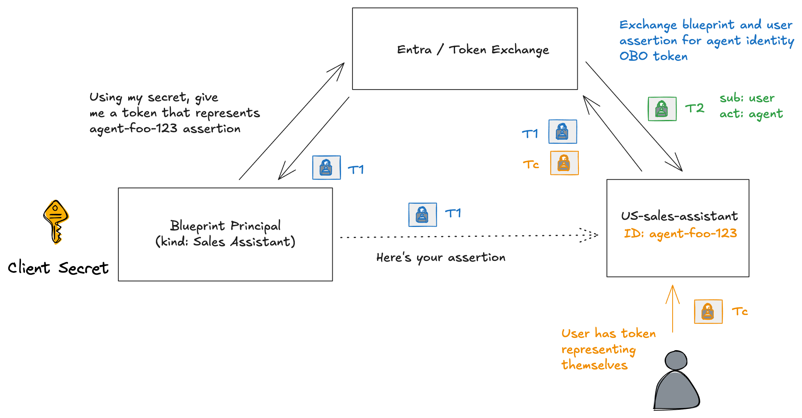
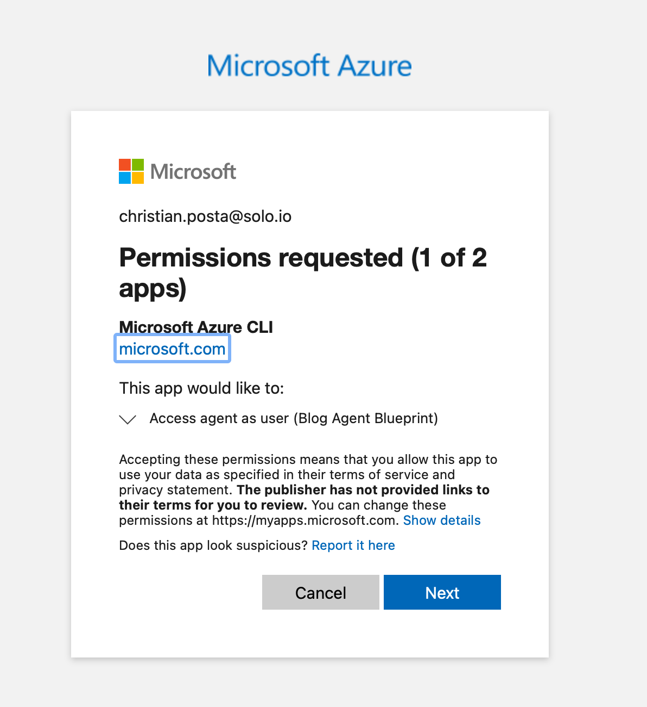
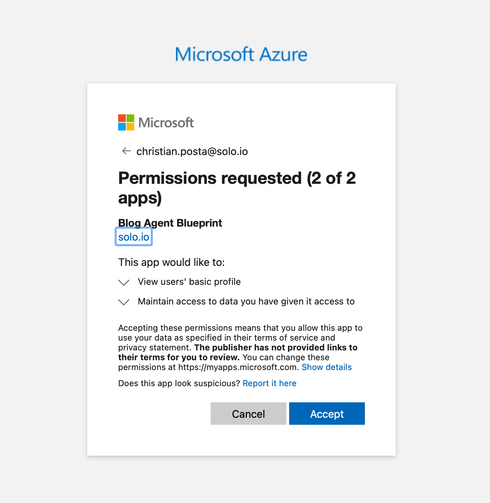

# Microsoft Entra Agent ID on Kubernetes

[Microsoft Entra Agent ID](https://learn.microsoft.com/en-us/entra/agent-id/identity-platform/) is a new feature for [Microsoft Entra](https://learn.microsoft.com/en-us/entra) that adds support for "AI Agent" workloads. In this context, an AI agent is a stateful service that can respond to tasks and work toward specified goals by using an AI model (often an LLM). An AI agent may be spun up dynamically and destroyed after its task has completed. It may last for a few seconds or many hours/days. Enterprise policy and compliance requires we know when agents make decisions and take actions. Since AI agents rely on AI models, they are non-deterministic and may take actions they originate or decide. For this reason, we need to be able to identify which workloads are AI agents, and understand what actions they take, why do they take them, and where an Agent got authorization to take the actions it did. I've written in the past about the need for [strong agent identity](https://blog.christianposta.com/do-we-even-need-agent-identity/) and the ability for agents to act as the user (impersonation) [or on behalf of the user (delegation)](https://blog.christianposta.com/agent-identity-impersonation-or-delegation/). 

This is part of a multi-part series where we dig into how Microsoft Entra Agent ID gives an option for agent identity. This set of guides will specifically dive deeply into how it works (it's full token-exchange mechanism) with the goal of getting it working on Kubernetes for Agent and MCP workloads outside of Azure. Azure has managed identities but they work within the Azure ecosystem, but if we want to expand past that, we need to understand how Agent ID works. If you're interested in this, please follow me [/in/ceposta](https://www.linkedin.com/in/ceposta) for updates!

# Part Two: Agent On-Behalf-Of User

Microsoft Entra Agent ID is an extension to Entra that adds agent identity as a first class citizen. In the previous section, we saw the mechanism for how this works:


This exchange allows an AI agent acquire an access token so that it can call other services (either on Azure, or other agents/MCP/APIs, etc). But like we saw in the last section, the actual token returned shows the AI agent as the subject:

```json
{
  "aud": "https://graph.microsoft.com",
  "iss": "https://sts.windows.net/<tenant-id-here>/",
  "app_displayname": "My Blog Agent",
  "appid": "f3897825-fd03-45f5-90eb-fdbf26135650",
  "appidacr": "2",
  "idp": "https://sts.windows.net/<tenant-id-here>/",
  "idtyp": "app",
  "oid": "f3897825-fd03-45f5-90eb-fdbf26135650",
  "sub": "f3897825-fd03-45f5-90eb-fdbf26135650",
  "xms_act_fct": "9 3 11",
  "xms_ftd": "pbOSYf1d04pEl3RJYvFlfLy2MQSivRCDf3sWSe-iB4UBdXNzb3V0aC1kc21z",
  "xms_idrel": "7 22",
  "xms_par_app_azp": "85075aa5-1d73-42de-812a-95348218e4b2",
  "xms_rd": "0.42LlYBJirBAS4WAXEmCx-ppqmnjfZzvfdr89yfe3AUU5hQTOextEiVqcc1m_tM_Y8bGfClCUQ0iAmQECDkBpKT4OLiEuQ3MzU0tjY1MDIwA",
  "xms_sub_fct": "11 3 9",
  "xms_tcdt": 1657299251,
  "xms_tnt_fct": "3 8"
}
```

The `sub` is the service principal for the agent `f3897825-fd03-45f5-90eb-fdbf26135650`:

If we list the AI agents:

```powershell
# List all agent identities using the dedicated endpoint
$agentIdentities = Invoke-MgGraphRequest -Method GET `
    -Uri "https://graph.microsoft.com/beta/servicePrincipals/graph.agentIdentity"

$agentIdentities.value | Select-Object displayName, appId, id | Format-Table
$agentIdentityAppId = $agentIdentity.appId   # Agent Identity's App ID
```

```bash
displayName                                   appId id
-----------                                   ----- --
ceposta-testing-ceposta-default-AgentIdentity       322bda81-038f-4736-8eb4-326cf213febc
My Test Agent                                       58326923-8cbc-4ef2-a30b-9c2a9684dbb1
My Blog Agent                                       f3897825-fd03-45f5-90eb-fdbf26135650
```

You can see `f3897825-fd03-45f5-90eb-fdbf26135650` is the agent's service principal.

So this means the AI agent is acting as itself. But what if we want to represent that the user authorized this and that the agent is acting "on behalf of" the user?

## Agent Acting on Behalf of the User

I recently published a [detaild comparison between](https://blog.christianposta.com/explaining-on-behalf-of-for-ai-agents/) OAuth delegation (ie, Authorization Code Flow), the Microsoft Entra [On Behalf Of Flow](https://learn.microsoft.com/en-us/entra/identity-platform/v2-oauth2-on-behalf-of-flow) and Agent [On Behalf Of](https://learn.microsoft.com/en-us/entra/agent-id/identity-platform/agent-on-behalf-of-oauth-flow?view=graph-rest-beta). There are subtle [differences between them](https://blog.christianposta.com/explaining-on-behalf-of-for-ai-agents/), so please review that blog to get the background for this next section.

In this section, we'll look at what's needed to enable Agent "on behalf of" so that we end up with a token (T2) that makes clear the `sub` is the user, but the actor is the AI agent. 



Just to point out clearly, this part is intended to help you understand the mechanism behind the scenes to get the right token. I am making no value judgements about whether this is good or even the right way to do in Kubernetes. We will address that as we go in the future parts. 

### Prerequisites

Before we are able to do an On Behalf Of exchage, we need to make some modifications to our **Agent Identity Blueprint**. Remember, a blueprint is a "class" or "template" of an AI agent identity. But it also kinda looks like an app registration. 

In the classic [service-to-service OBO exchange](https://learn.microsoft.com/en-us/entra/identity-platform/v2-oauth2-on-behalf-of-flow), the service can only do the exchange if the `aud` of the token correctly matches its own `client_id`. The Microsoft Entra STS will reject the token exchange request if this is not the case. The same will be true for blueprint and AI agents identities. So the user will need to make its token request for the API/scope represented on the blueprint. When we created the blueprint, we did not specify an APIs or scopes, so the pre-requisite is to set this up.

This part will require us to use the Graph Beta API. In our powershell session, we'll need to make sure the Beta API is available:

```powershell
# Install the beta module if not already installed
Install-Module Microsoft.Graph.Beta -Scope CurrentUser

# Import the beta module
Import-Module Microsoft.Graph.Beta.Applications
```

Now, connect up with the appropriate scopes (if you still have your session from Part One, you may skip this):

```powershell
# Make sure to connect with these perms
Connect-MgGraph -Scopes @(
    "AgentIdentityBlueprint.ReadWrite.All",
    "Application.ReadWrite.All"
)
```

Let's set up the app URL first. Note this uses the `Update-MgBetaApplication` command which is a Beta module. See earlier steps for setting that up. 

```powershell
# Your Blueprint's Client ID
$blueprintAppId = "<your-blueprint-client-id>"


# Get the Blueprint application object
$blueprintApp = Get-MgApplication -Filter "appId eq '$blueprintAppId'"
$blueprintAppObjectId = $blueprintApp.Id

Write-Host "Blueprint Object ID: $blueprintAppObjectId"

# Step 2a: Set the Application ID URI
$appIdUri = "api://$blueprintAppId"

Update-MgBetaApplication -ApplicationId $blueprintAppObjectId -IdentifierUris @($appIdUri)

Write-Host "✅ Set App ID URI to: $appIdUri"
```

You should see something like this:

```bash
✅ Set App ID URI to: api://85075aa5-1d73-42de-812a-95348218e4b2
```

Now we need to add an a "[delegated permission](https://learn.microsoft.com/en-us/entra/identity-platform/delegated-access-primer)" to the blueprint so that clients can reques them in their scopes. 

```powershell
# Step 2b: Add the 'access_as_user' scope
$newScopeId = (New-Guid).Guid

$apiSettings = @{
    Oauth2PermissionScopes = @(
        @{
            Id = $newScopeId
            AdminConsentDescription = "Allow the application to access the agent on behalf of the signed-in user"
            AdminConsentDisplayName = "Access agent as user"
            IsEnabled = $true
            Type = "User"
            UserConsentDescription = "Allow the application to access the agent on your behalf"
            UserConsentDisplayName = "Access agent as user"
            Value = "access_as_user"
        }
    )
}

Update-MgBetaApplication -ApplicationId $blueprintAppObjectId -Api $apiSettings

Write-Host "✅ Added 'access_as_user' scope"
Write-Host "Full scope: api://$blueprintAppId/access_as_user"
```

You should see something like this:

```bash
✅ Added 'access_as_user' scope

Full scope: api://85075aa5-1d73-42de-812a-95348218e4b2/access_as_user
```

Now that the blueprint is set up to allow users to request the `access_as_user` scope on the `api://85075aa5-1d73-42de-812a-95348218e4b2` API, we can tweak the previous (Part One) steps to include the user's token (Tc). 

When the user logs in, they need to request the `api://85075aa5-1d73-42de-812a-95348218e4b2/access_as_user` scope:

```bash
az logout
az login --tenant $tenantId --scope "api://$blueprintAppId/access_as_user"
```
You will see consent screens to approve this scope:




Now we can get the user's token:

```powershell
$userToken = az account get-access-token --resource "api://$blueprintAppId" --query accessToken -o tsv
```

Now we have the user's token (Tc). Now we can do the blueprint impersonation steps from Part One:

```powershell
# Step 3: Get blueprint token with fmi_path pointing to agent identity
$t1Body = @{
    client_id     = $blueprintAppId
    scope         = "api://AzureADTokenExchange/.default"
    grant_type    = "client_credentials"
    client_secret = $clientSecret
    fmi_path      = $agentIdentityAppId
}

$t1Response = Invoke-RestMethod -Method POST `
    -Uri "https://login.microsoftonline.com/$tenantId/oauth2/v2.0/token" `
    -ContentType "application/x-www-form-urlencoded" `
    -Body $t1Body

$blueprintToken = $t1Response.access_token
Write-Host "✅ Got blueprint impersonation token (T1) - length: $($blueprintToken.Length)"
```

Before we are able to use the Tc and T1 token to get the Agent's OBO token (T2), there is actually one more step we need to complete. From the `az login` command, we did consent to the `acces_as_user` scope but our Agent will ask for Graph scopes on behalf of this user. This has not been consented yet. For our example here, we'll grant "admin consent" for this, Otherwise we'd see an error like this:

```JSON
  "error_description": "AADSTS65001: The user or administrator has not consented to use the application with ID \u0027f3897825-fd03-45f5-90eb-fdbf26135650\u0027 named \u0027My Blog Agent\u0027. Send an interactive authorization request for this user and resource.",
```


```powershell
# Get the Microsoft Graph service principal
$graphSp = Invoke-MgGraphRequest -Method GET `
    -Uri "https://graph.microsoft.com/v1.0/servicePrincipals?`$filter=appId eq '00000003-0000-0000-c000-000000000000'"

$graphSpId = $graphSp.value[0].id
Write-Host "Graph Service Principal ID: $graphSpId"

# Grant admin consent for delegated permissions
# This creates an OAuth2PermissionGrant (admin consent for all users in tenant)
$consentBody = @{
    clientId    = $agentIdentityAppId       # The Agent Identity's ID
    consentType = "AllPrincipals"        # Admin consent for all users
    resourceId  = $graphSpId             # Microsoft Graph
    scope       = "User.Read openid profile offline_access"  # Scopes needed for OBO
} | ConvertTo-Json

Invoke-MgGraphRequest -Method POST `
    -Uri "https://graph.microsoft.com/v1.0/oauth2PermissionGrants" `
    -Body $consentBody `
    -ContentType "application/json"

Write-Host "✅ Admin consent granted for Agent Identity"
```

> **Note**: You only need to do this once per Agent Identity. Add more scopes to the `scope` field if your agent needs additional permissions (e.g., `Mail.Read`, `Calendars.Read`).

Okay, now we can use the user's token (Tc) and the impersonation token (T1) to get the agent's OBO token (T2):

```powershell
$t2Body = @{
    client_id              = $agentIdentityAppId
    scope                  = $targetScope
    client_assertion_type  = "urn:ietf:params:oauth:client-assertion-type:jwt-bearer"
    client_assertion       = $blueprintToken  # T1
    grant_type             = "urn:ietf:params:oauth:grant-type:jwt-bearer"
    assertion              = $userToken       # Tc
    requested_token_use    = "on_behalf_of"
}

$t2Response = Invoke-RestMethod -Method POST `
    -Uri "https://login.microsoftonline.com/$tenantId/oauth2/v2.0/token" `
    -ContentType "application/x-www-form-urlencoded" `
    -Body $t2Body

$resourceToken = $t2Response.access_token
$refreshToken = $t2Response.refresh_token  # Save for async/background scenarios

Write-Host "✅ Got resource token (T2) - length: $($resourceToken.Length)"
Write-Host "✅ Got refresh token - length: $($refreshToken.Length)"
```

Yay! Now the agent has an OBO token for the user. It should look something like this:

```json
{
  "aud": "https://graph.microsoft.com",
  "iss": "https://sts.windows.net/<tenant-id>/",
  "iat": 1765996854,
  "nbf": 1765996854,
  "exp": 1766000220,
  "acct": 0,
  "acr": "1",
  "acrs": [
    "p1"
  ],
  "aio": "AZQAa/8aAAAAU/dc8DGuQh4g3jXE1al7bmKwM9FkHAA0TXhpk0ND+l3LqBFflfpJ/WSSH4Uf1cnin8o6gAbtPKBZBF17lgmsuyJwzW56YpT4hXo3tocw5/LJvgYSSDvDUTLaMK5GrF6cEBiZRHWWKWY9ZnEV/t7bz6o92AjJym6Lezvd7nXUCvZPG3VGCdidvaTwTegmZS0R",
  "amr": [
    "pwd",
    "mfa"
  ],
  "app_displayname": "My Blog Agent",
  "appid": "f3897825-fd03-45f5-90eb-fdbf26135650",
  "appidacr": "2",
  "idtyp": "user",
  "ipaddr": "72.208.175.26",
  "name": "Christian Posta",
  "oid": "0501a526-79e4-46ff-bd07-6605a752287b",
  "platf": "5",
  "puid": "100320054BABC41C",
  "rh": "1.AXgAZoF9XnZ4VUehpLR21KNE9gMAAAAAAAAAwAAAAAAAAAB4ALt4AA.",
  "scp": "openid profile User.Read email",
  "sid": "00b79819-e0b7-43f7-5402-99bb2eeec2ab",
  "sub": "93m3ed3gY2h-GzDAQ0wyVuqRu1hLfBsDDXdealS9RLQ",
  "tenant_region_scope": "NA",
  "tid": "<tenant-id>",
  "unique_name": "christian.posta@solo.io",
  "upn": "christian.posta@solo.io",
  "uti": "EYmjc8YOOU69N_m503YlAA",
  "ver": "1.0",
  "wids": [
    "db506228-d27e-4b7d-95e5-295956d6615f",
    "e8611ab8-c189-46e8-94e1-60213ab1f814",
    "b79fbf4d-3ef9-4689-8143-76b194e85509"
  ],
  "xms_act_fct": "3 9 11",
  "xms_ftd": "dQTPDm-udUoGLnT5EZioW9n52HYQeC3mZV-Um2FMbs4BdXN3ZXN0My1kc21z",
  "xms_idrel": "1 12",
  "xms_par_app_azp": "85075aa5-1d73-42de-812a-95348218e4b2",
  "xms_st": {
    "sub": "dyZmxQd3EgJO50_AbJM6qNmtE5g45TdnSOSg_MSCg0E"
  },
  "xms_sub_fct": "3 12",
  "xms_tcdt": 1657299251,
  "xms_tnt_fct": "3 10"
}
```

Now let's dig into these claims to see what it represents:

* **aud**: `https://graph.microsoft.com` this agent can call the graph API with this token
* **appId**: `f3897825-fd03-45f5-90eb-fdbf26135650` this is the agent's underlying identity/service principal in Entra
* **sub**: `93m3ed3gY2h-GzDAQ0wyVuqRu1hLfBsDDXdealS9RLQ` a [hash that represents](https://learn.microsoft.com/en-us/entra/identity-platform/id-token-claims-reference) the user
* **oid**: `0501a526-79e4-46ff-bd07-6605a752287b` this is the user's identity/principal
* **idtyp**: `user` this token represents an user! 
* **xms_act_fct**: `3 9 11` this represents this is an AI agent acting
* **xms_sub_fct**: `3 12` this agent is acting on behalf of a user! There is no `11`
* **xms_par_app_azp*: `85075aa5-1d73-42de-812a-95348218e4b2` this agent was created by the blueprint

With this Agent ID token, we can call the Graph API (or we could have scoped it to a different app, MCP server, or agent) and that target (Graph in this case) would know that this is indeed an AI agent calling it **on behalf of a user**. Agent OBO specific policy can be enforced at this point. 

## Wrapping up

This (Part Two) continues our deep dive on Entra Agent ID on Kubernetes (outside Azure). Again, this post is meant purely for educational purposes, no comments yet how this should be used on Kubernetes if not on Azure. Azure handles all of this behind the scenes, but if you are looking to use this outside of Azure, stay tuned to the next parts!