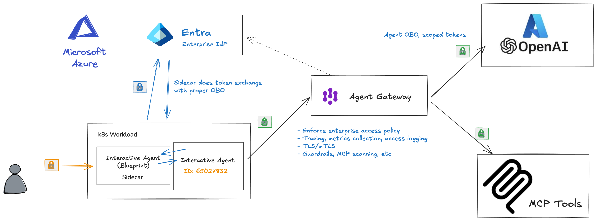

# Microsoft Entra Agent ID on Kubernetes

This is part of a multi-part series where we dig into how Microsoft Entra Agent ID works for agent identity. This set of guides will specifically dive deeply into how it works (it's full token-exchange mechanism) with the goal of getting it working on Kubernetes (not necessarily AKS, but would apply there too) for Agent and MCP workloads.  If you're interested in this, please follow me [/in/ceposta](https://www.linkedin.com/in/ceposta) for updates!

# Part Five: LLM and MCP with Entra Agent ID and AgentGateway

[← Back to Series](index.md)

> **Source Code**: This part covers a complete working example. The full AI Agent CLI application, including Azure OpenAI integration, MCP server connectivity, and AgentGateway configuration, can be found in the [`ai-agent-cli/`](https://github.com/christian-posta/entra-agent-id-agw) directory in the [repository](https://github.com/christian-posta/entra-agent-id-agw).

So far, we've seen Entra Agent ID in detail, how to run it on Kubernetes, and how to use workload identity federation. In this last part, we'll walk through a full working example of an AI agent that uses Microsoft Entra and Agent ID to communicate/Auth with an Azure OpenAI LLM and a custom MCP server. We'll use OBO flow to call the MCP server on behalf of the user and we'll mediate all of this traffic with [AgentGateway](https://agentgateway.dev) which is an LLM and MCP gateawy. 



We will also answer the questions from Part 3 and Part 4:

* We don't want to use blueprint client secrets in our configuration 
* Do you use a single blueprint config for everything? 
* How do you map the blueprints to Kubernetes pods? 
* How do you map agent identities? 
* How do they get created?

## End to End Demo

I have built a chat application that uses an LLM and can add/list/use MCP tools. You can find it in [./ai-agent-cli](./ai-agent-cli). 

There are a few things to note in this app:

* Runs in Kubernetes
* Device code flow OAuth user login
* Connects to Azure OpenAI with either API key (testing) or OBO Agent token (production)
* Can add MCP servers
* Call MCP servers with OBO Agent ID token
* LLM can use tools from the MCP server
* All traffic is secured with AgentGateway

You'll notice a `./ai-agent-cli/deploy.sh` script to deploy into kubernetes. We use the sidecar and workload identity federation from the previous parts to deploy this. We configure all env vars in the configmaps. 

If we deploy the apps to a Kubernetes cluster:

```bash
./deploy.sh
```

We can see what pods get started:

```bash
kubectl get pod -n entra-demo

NAME                            READY   STATUS    RESTARTS      AGE
agentgateway-7694794987-wp9jv   1/1     Running   1 (32h ago)   15d
ai-agent-cli-6886cb6b8f-njzhn   2/2     Running   0             13m
```

We see both the agent pod and the [agentgateway](https://agentgateway.dev) are deployed. The agent is configured to call the LLM and MCP through agentgateway. 

Here's the config for LLM in agentgateway:

```yaml
    - name: openai
      matches:
      - path:
          pathPrefix: /llm
      backends:
      - ai:
          name: openai
          hostOverride: "ceposta-azure-openai.openai.azure.com:443"
          provider:
            openAI:
              model: gpt-4.1-mini
      policies:

        ## We require JWT auth for calling this route
        ## it is expected to be coming from an SSO IdP  
        jwtAuth:
          mode: strict
          issuer: https://sts.windows.net/<tenant-id>/
          audiences: [https://cognitiveservices.azure.com]
          jwks:
            url: https://login.microsoftonline.com/<tenant-id>/discovery/v2.0/keys    
```

You can see we are proxying the call to Azure OpenAI (within the kubernetes cluster it's reachable on `http://agentgateway.entra-demo:3000/llm`), but we are validating the token and checking for the correct audience. For the MCP server, we do a little more checking:

```yaml
    - matches:
      - path:
          exact: /mcp
      backends:
      - mcp:
          targets:
          - name: microsoft
            mcp:
              host: "learn.microsoft.com"
              port: 443
              path: "/api/mcp"              
          - name: exa-ai
            mcp:
              host: "mcp.exa.ai"
              port: 443
              path: "/mcp"
      policies:
        jwtAuth:
          mode: strict
          issuer: https://sts.windows.net/<tenant-id>/
          audiences: [api://ec791040-80f8-4129-bf34-96a0e0672c96]
          jwks:
            url: https://login.microsoftonline.com/<tenant-id>/discovery/v2.0/keys            
        mcpAuthorization:
          rules:
          # This has to be OBO a user, and called by an AI agent identity we recognize
          - "jwt.appid == '65027832-f56f-4d8e-93aa-a09113ba2d47' && '11' in jwt.xms_act_fct.split(' ')"
```

In this configuration, we are proxying to multiple backend MCP servers. The client sees a single unified list, but multiple backend MCP servers are exposed. We also check the audience is correclty set to the MCP server identity and we also check the token claims to make sure it's from the AI agent we expect and that it's indeed an Agent OBO token. We check the `xms_act_fct` claims for this. 

We can login to our ai-agent-cli app with the following:

```bash
kubectl exec -n entra-demo -it deployment/ai-agent-cli -c app -- python -m agent_cli.main run
```

This will start the device code login:

```bash
Starting AI Agent CLI...

Running in PRODUCTION MODE (Entra OBO, provider=sidecar)

Step 1: User Authentication
Requesting token with Blueprint audience: api://335bdf2e-954f-40b1-bd41-332bda33ee00
Requesting user token with Blueprint audience: api://335bdf2e-954f-40b1-bd41-332bda33ee00

To sign in, use a web browser to open the page https://microsoft.com/devicelogin and enter the code XXXXXXXXXXX to authenticate.
```

After completing the login, you should see the ai agent acquire the tokens it needs:

```bash
✓ Authentication successful, token cached for future use
✓ Logged in as: christian.posta@solo.io

Step 2: Initializing Token Provider (sidecar mode)
Using SidecarTokenProvider (delegating to sidecar)
✓ SidecarTokenProvider initialized (sidecar at http://localhost:5000)

Step 3: Getting OBO token for Azure OpenAI
Calling sidecar: GET /AuthorizationHeader/openai
✓ Got token from sidecar for openai
✓ Azure OpenAI OBO token acquired

Step 4: Getting OBO token for MCP Server
Calling sidecar: GET /AuthorizationHeader/mcp
✓ Got token from sidecar for mcp
✓ MCP Server OBO token acquired

✓ Agent initialized with OBO authentication


═══════════════════════════════════════
           AI Agent CLI
           Logged in as: christian.posta@solo.io
═══════════════════════════════════════

1. Prompt agent
2. List MCP tools
3. Add MCP tool server
4. Remove MCP tool server
5. Clear conversation history
6. Exit

Select an option [1/2/3/4/5/6]:
```


To see the complete demo, take a look here:


<iframe width="560" height="315" src="https://www.youtube.com/embed/xO0xRV3M64U?si=2S7cGXZd_w71MS5x" title="YouTube video player" frameborder="0" allow="accelerometer; autoplay; clipboard-write; encrypted-media; gyroscope; picture-in-picture; web-share" referrerpolicy="strict-origin-when-cross-origin" allowfullscreen></iframe>


Lastly, instead of running the ai agent, we can inspect the tokens that it acquires with the `show-tokens` command:

```bash
kubectl exec -n entra-demo -it deployment/ai-agent-cli -c app -- python -m agent_cli.main show-tokens --output-raw
```

This will show the raw and decoded tokens with a final summary that looks like this:


```bash

Token Summary
┏━━━━━━━━━━━━━━━━━━━┳━━━━━━━━━━━━━━━━━━━━━━━━━━━━━━━━━━━━━━━━━━━━━┳━━━━━━━━━━━━━━━━━━━━━━━━━━━━━━━━━━━━━━━━━━━━━┳━━━━━━━━━━━━━━━━━━━━━━━━━━━━━━━━━━━━━━┳━━━━━━━━┓
┃ Token             ┃ Audience (aud)                              ┃ Subject (sub)                               ┃ App ID (appid)                       ┃ Status ┃
┡━━━━━━━━━━━━━━━━━━━╇━━━━━━━━━━━━━━━━━━━━━━━━━━━━━━━━━━━━━━━━━━━━━╇━━━━━━━━━━━━━━━━━━━━━━━━━━━━━━━━━━━━━━━━━━━━━╇━━━━━━━━━━━━━━━━━━━━━━━━━━━━━━━━━━━━━━╇━━━━━━━━┩
│ Tc (User)         │ 335bdf2e-954f-40b1-bd41-332bda33ee00        │ VqxPWu-RIKH_MSB1CciEkLVzBHrZ8H1L25D7K8H6Mh4 │ 14d82eec-204b-4c2f-b7e8-296a70dab67e │ ✓      │
│ T2 (Azure OpenAI) │ https://cognitiveservices.azure.com         │ christian.posta@solo.io                     │ 65027832-f56f-4d8e-93aa-a09113ba2d47 │ ✓      │
│ T2 (MCP Server)   │ api://ec791040-80f8-4129-bf34-96a0e0672c... │ christian.posta@solo.io                     │ 65027832-f56f-4d8e-93aa-a09113ba2d47 │ ✓      │
└───────────────────┴─────────────────────────────────────────────┴─────────────────────────────────────────────┴──────────────────────────────────────┴────────┘
```

## Answering the Previous Questions

#### We don't want to use blueprint client secrets in our configuration 

Good point. We don't want to use client secrets for our Agent Blueprint. Client credentials are sensitive secrets that need to be copied over to the kubernetes cluster somehow, and could easily leak. The are exposed as environment variables or in plaintext configuration. Alternatively, you could store them in Vault. These are typically long-lived secrets that don't expire or get rotated.  

The documentation recommends using either workload identity federation or managed identities. We have walked through setting up workload identity federation in these guides. Managed identity is very similar but Azure manages the setup process and makes short-lived tokens available through a locally running/available metadata service. 

#### Do you use a single blueprint config for everything? 

A single blueprint is meant to be a template for specific class or type of agents. You'd likely not use a single blueprint for all of your agents running on Kubernetes, but again, it depends on your usecase. 

#### How do you map the blueprints to Kubernetes pods? 

Conceptually, blueprints map closely to a Kubernetes [Service Account](https://kubernetes.io/docs/concepts/security/service-accounts/). Multiple deployments could share a single service account, but for more fine-grained control, you'd assign individual service accounts per certain deployments. Kubernetes pods/replicas from a deployment are all meant to be "identical". So from an Agent ID standpoint, all pods from a deployment share the same blueprint.

#### How do you map agent identities? 

In this model, the most straight forward mapping is a single Agent Identity is mapped to a [Kubernetes Deployment](https://kubernetes.io/docs/concepts/workloads/controllers/deployment/). Each replica would have the same agent identity. Entra Agent ID can support a model where an agent runtime that lives on top of Kubernetes and manages identity issuance to multiple agents running within pods, but there may be tradeoffs to that. 

#### How do they get created?

Agent blueprints and agent identities would need to be created ahead of time through some administraive process. Permissions and roles would be assigned at this time. 

## Wrapping Up

This has been a deep dive of Entra Agent ID. If you're running on Kubernetes and need guidance, [please feel free to reach out](https://www.linkedin.com/in/ceposta). Please checkout [Agent Gateway](https://agentgateway.dev) for network and policy control for agentic usecases.

---

**Previous:** [Part Four: Workload Identity Federation](PART-4.md) | [Back to Series](index.md)

 